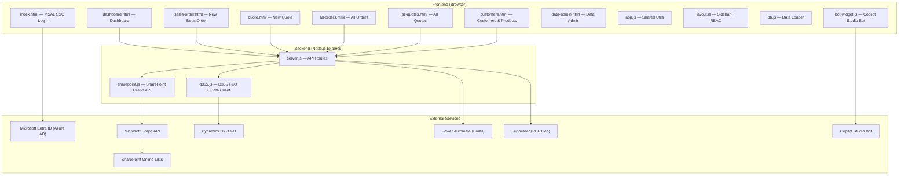
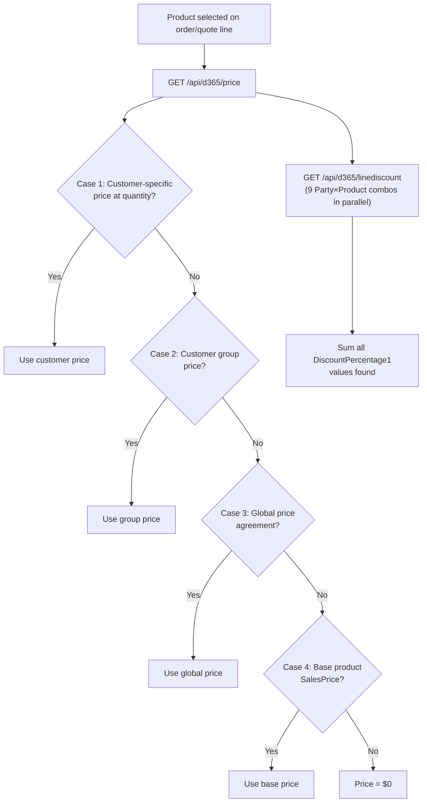
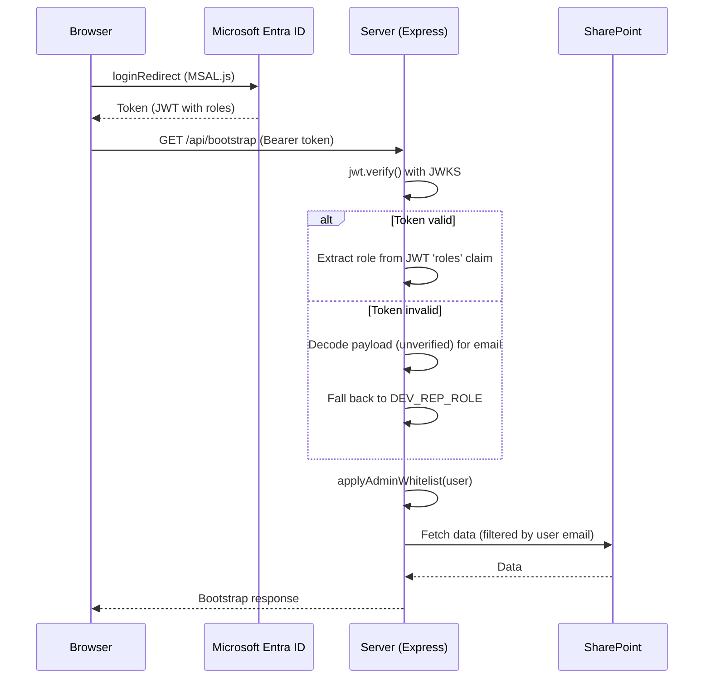

# Pascal Press Sales Rep Portal — Senior Developer Code Analysis

## 1. Architecture Overview



| Layer | Tech | Purpose |
|---|---|---|
| **Frontend** | Vanilla HTML/CSS/JS | 8 HTML pages, no framework, each ~1500 lines |
| **Backend** | Node.js + Express 5 | API middleware at `server.js` (1342 lines) |
| **Data (Primary)** | SharePoint Online Lists | 6 lists: Company, AllCustomers, SalesOrderHeader, SalesOrderLines, SalesQuoteHeader, SalesQuoteLines |
| **Data (D365)** | Dynamics 365 F&O OData | Customers, Products, Price Agreements, Line Discounts, Sales Orders |
| **Auth** | Microsoft Entra ID (MSAL.js) | Frontend SSO → JWT token → server validates |
| **Email** | Power Automate HTTP trigger | Sends quote emails with optional PDF attachment |
| **PDF** | Puppeteer (headless Chrome) | Generates quote PDFs server-side |
| **Bot** | Copilot Studio (iframe) | Floating chat widget on dashboard |

---

## 2. Module-by-Module Analysis

### 2.1 [server.js](file:///d:/1Dynamics/Pascal%20Portal/server.js) — API Middleware (1342 lines)

**What it does:**
- Express 5 server serving static files + API routes
- JWT validation middleware with Entra ID public keys (JWKS)
- RBAC system: `salesrep < manager < admin`
- Admin email whitelist promotion/demotion
- CRUD endpoints for: Companies, Customers, Sales Orders (header + lines), Quotes (header + lines)
- Quote lifecycle: Draft → Active → Accepted → Converted (to Sales Order)
- Quote revision system (immutable audit trail)
- Quote-to-Order conversion endpoint
- Email sending via Power Automate (with PDF attachment)
- D365 proxy endpoints: customers, products, sales orders, price lookup, line discount lookup
- Server-side PDF generation via Puppeteer

**Key Endpoints:**

| Endpoint | Method | Purpose |
|---|---|---|
| `/api/bootstrap` | GET | All data for current user (SP lists) |
| `/api/auth/me` | GET | Current user profile |
| `/api/salesorders` | GET/POST | List/create sales orders |
| `/api/salesorders/header` | POST | Create order header (server-generates ID) |
| `/api/salesorders/:salesId/lines` | POST | Add lines to order |
| `/api/quotes/header` | POST | Create quote header |
| `/api/quotes/:quoteId/lines` | POST | Add lines to quote |
| `/api/quotes/:quoteId/revise` | POST | Create revision (locks old as "Revised") |
| `/api/quotes/:quoteId/convert` | POST | Convert accepted quote → sales order |
| `/api/email/quote/:quoteId` | POST | Send quote email with PDF |
| `/api/d365/customers` | GET | D365 customers (cached) |
| `/api/d365/products` | GET | D365 products (cached) |
| `/api/d365/price` | GET | 4-case price cascade lookup |
| `/api/d365/linediscount` | GET | 9-case line discount lookup |
| `/api/d365/price/table` | GET | All price agreements for item |

---

### 2.2 [d365.js](file:///d:/1Dynamics/Pascal%20Portal/d365.js) — Dynamics 365 F&O OData Client (444 lines)

**What it does:**
- OAuth 2.0 client_credentials token (v1 endpoint with `resource` parameter)
- Token cached until 60s before expiry
- In-memory customer cache (5-min TTL, up to 500 records)
- In-memory product cache (10-min TTL, up to 1000 records)
- Generic `_get`, `_post`, `_patch` OData helpers
- CRUD for: Customers (CustomersV3), Products (ReleasedProductsV2), Sales Orders (SalesOrderHeadersV2 + SalesOrderLines)

**Price Cascade Logic** (`getSalesPriceAgreements`):
```
Case 1: Customer-specific price at quantity → SalesPriceAgreements
Case 2: Customer group price               → SalesPriceAgreements
Case 3: Global / all-customer price         → SalesPriceAgreements
Case 4: Base product SalesPrice             → ReleasedProductsV2
```
Returns the **first match** in priority order (stops as soon as a price is found).

**Line Discount Logic** (`getSalesLineDiscounts`):
- Runs **9 combinations** of Party × Product against `SalesLineDiscountAgreements`
- Uses `Promise.allSettled` for parallel execution (resilient to individual failures)
- **Sums all matching** `DiscountPercentage1` values (cumulative discounts)

> [!WARNING]
> **Summing all matching discount percentages** may produce incorrect results. D365's native pricing engine applies discounts hierarchically, not additively. A customer-specific 10% + group 5% should not simply be 15%.

---

### 2.3 [sharepoint.js](file:///d:/1Dynamics/Pascal%20Portal/sharepoint.js) — SharePoint Graph Client (606 lines)

**What it does:**
- OAuth 2.0 client_credentials for Microsoft Graph
- Token cached until 60s before expiry
- List ID resolution: env var → in-memory cache → Graph API lookup by display name
- Reads all items from 6 SharePoint lists in parallel (bootstrap)
- Maps raw SP fields → clean domain objects (Company, Customer, Order, OrderLine, Quote, QuoteLine)
- Computes dashboard summary (orders today/week/month, revenue, open orders)
- **Email-based data filtering**: non-admin users only see their own orders/quotes
- Order total computed from attached line items (price × qty × (1 - discount%))
- Line items linked to orders/quotes by stripping `-Ln` suffix from SalesId/QuotationId

**SharePoint Column Name Confusion (documented in code):**
- Quote lines: SP internal `SalesPrice` = display column "SalesUnit" (the unit field)
- Quote lines: SP internal `SalesPrice0` = display column "SalesPrice" (the actual price)

---

### 2.4 [app.js](file:///d:/1Dynamics/Pascal%20Portal/app.js) — Shared Frontend Utilities (345 lines)

**Provides via `window.PP`:**
- Toast notifications, modal open/close helpers
- Tab switching, active nav highlighting
- Customer search (delegated to DB module)
- Sales rep getter from localStorage
- Currency/date formatting (AUD locale)
- Status badge HTML generation
- Excel export (SheetJS XLSX): orders list + order detail sheets
- Topbar user chip display
- `nextOrderId()` — client-side ID generator (format: `PAS-YYYYMMDD-NNNN`)

---

### 2.5 [layout.js](file:///d:/1Dynamics/Pascal%20Portal/layout.js) — Shared Sidebar + RBAC (269 lines)

**What it does:**
- Dynamic sidebar injection via `<div id="pp-sidebar">`
- Navigation items with role-based visibility (`minRole`)
- Mobile responsive: hamburger menu + backdrop
- Page-level RBAC guard (redirects unauthorized users)
- `ppConfirm()` — custom confirm dialog replacing `window.confirm()`
- On boot: fetches `/api/bootstrap`, extracts role, re-renders sidebar with correct permissions
- **Never caches role** — always fetches fresh from server

**Navigation Structure:**
| Item | Min Role | Page |
|---|---|---|
| Dashboard | salesrep | dashboard.html |
| Orders | salesrep | all-orders.html |
| Quotes | salesrep | all-quotes.html |
| Data Admin | **admin** | data-admin.html |
| Customers | salesrep | customers.html |
| Products | salesrep | customers.html#products |

---

### 2.6 [db.js](file:///d:/1Dynamics/Pascal%20Portal/db.js) — Data Loader (101 lines)

**What it does:**
- Singleton module (IIFE + revealing module pattern)
- Loads from `/api/bootstrap` → falls back to MOCK data
- Syncs loaded data back to `PP.MOCK` for backward compatibility
- Customer search function used by order/quote pages

---

### 2.7 [bot-widget.js](file:///d:/1Dynamics/Pascal%20Portal/bot-widget.js) — Copilot Studio Bot (104 lines)

**What it does:**
- Floating chat button (bottom-right, teal gradient)
- Opens Copilot Studio webchat in iframe panel
- Auto-lifts above sticky footer on order/quote pages
- Responsive: full-width on mobile

---

## 3. Page-by-Page Analysis

### 3.1 Login Page ([index.html](file:///d:/1Dynamics/Pascal%20Portal/index.html))

- Split-panel design: brand info left, sign-in form right
- **MSAL.js 2.37.1** (loaded from CDN)
- `loginRedirect` flow → handles redirect promise on page load
- Acquires **two tokens**: User.Read (login) + App token (roles)
- Also acquires Power Platform token for Copilot Studio
- Stores `pp_salesrep`, `pp_token`, `pp_bot_token` in localStorage
- Client ID and Tenant ID are **hardcoded** in the HTML

### 3.2 Dashboard ([dashboard.html](file:///d:/1Dynamics/Pascal%20Portal/dashboard.html))

- Welcome banner with time-of-day greeting
- **4 stat cards**: Orders Today, Orders This Week, Revenue This Month, Open Orders
- "Continue Orders" section: In-Progress orders with "Add Lines" / "Edit Header" buttons
- "Active Quotes" section: quotes awaiting customer response
- **Recent Orders table** (top 5)
- **Donut chart** (SVG): order status distribution
- **Bar chart** (CSS): revenue by month (last 6 months)
- **Activity timeline**: last 5 orders
- **Sales Performance panel**: month revenue, YTD, avg order value, top customer
- **Active Customers panel**: merges D365 customers with SP order counts

### 3.3 New Sales Order ([sales-order.html](file:///d:/1Dynamics/Pascal%20Portal/sales-order.html))

- **2-step pipeline**: Header → Lines
- Step 1: Customer search (D365), auto-fills terms/address, order header fields
- Step 2: Line items table with per-row product search (D365), quantity, price, discount, delivery type
- **D365 price/discount auto-lookup**: when product is selected, fetches price cascade + line discounts
- Totals: subtotal, discount, GST (10%), freight, grand total
- Save Draft → saves header to SP (status=In Progress)
- Submit Order → saves lines to SP + updates status to Submit
- Resume: `?resume=PAS-xxx` loads existing order for editing
- Confirm modal with summary before final submit

### 3.4 New Quote ([quote.html](file:///d:/1Dynamics/Pascal%20Portal/quote.html))

- **2-step pipeline**: Header → Lines (orange accent instead of teal)
- Almost identical UX to sales-order but with quote-specific fields:
  - Valid Until date (default +30 days)
  - Customer Notes (visible on PDF)
  - No freight field
- **Activate flow**: Draft → save lines → Activate (status=Active)
- Success modal offers: Export PDF, Send Email, View All Quotes
- **Email modal**: send quote to customer with optional custom message
- Quote revision support via `?resume=QUO-xxx`

### 3.5 Customers & Products ([customers.html](file:///d:/1Dynamics/Pascal%20Portal/customers.html))

- **Tab-based**: Customers tab + Products tab (via URL hash)
- Customers: loads from D365, searchable, shows account details
- Products: loads from D365, searchable, shows price/unit details
- "New Order" / "New Quote" buttons per customer → passes customer via sessionStorage

### 3.6 All Orders ([all-orders.html](file:///d:/1Dynamics/Pascal%20Portal/all-orders.html))

- Lists all orders from SharePoint bootstrap
- Status filters, search, sorting
- Order detail expandable rows (shows lines)
- Excel export

### 3.7 All Quotes ([all-quotes.html](file:///d:/1Dynamics/Pascal%20Portal/all-quotes.html))

- Lists all quotes from SharePoint bootstrap
- Full lifecycle management: Draft → Active → Accepted → Converted
- Status change actions (Accept, Reject, Revise, Convert to Order)
- Quote detail view with line items
- Email sending modal

### 3.8 Data Admin ([data-admin.html](file:///d:/1Dynamics/Pascal%20Portal/data-admin.html))

- **Admin-only** (RBAC enforced on both client and server)
- CRUD for Companies and Customers (SharePoint lists)
- Order management (delete orders, update status)
- Sync status view

---

## 4. Pricing & Discount System

### Price Lookup Flow (D365)


### Discount Cascade Matrix (9 combinations)

| # | Party Filter | Product Filter |
|---|---|---|
| 1 | Customer Account | Item Number |
| 2 | Customer Group | Item Number |
| 3 | All (empty) | Item Number |
| 4 | Customer Account | Product Group |
| 5 | (empty group) | Product Group |
| 6 | All (empty) | Product Group |
| 7 | Customer Account | All (empty) |
| 8 | Customer Group | All (empty) |
| 9 | All (empty) | All (empty) |

---

## 5. Authentication & Authorization

### Auth Flow


### RBAC Rules
| Role | Level | Access |
|---|---|---|
| `salesrep` | 1 | Dashboard, Orders, Quotes, Customers, Products |
| `manager` | 2 | Same as salesrep + delete orders/lines |
| `admin` | 3 | Everything + Data Admin page |

### Admin Whitelist
- `ADMIN_EMAILS` in `.env` — comma-separated list
- If user's email **is in list** → role promoted to `admin`
- If user's email **is NOT in list** but JWT claims admin → role **demoted to salesrep**
- This is a strict allowlist (security control)

---

## 6. Critical Issues & Recommendations

### 🔴 Security Issues

| # | Severity | Issue | Location |
|---|---|---|---|
| 1 | **CRITICAL** | `.env` with all secrets (client secrets, tenant IDs, API keys) is committed to git. `.gitignore` should exclude it but it's in the repo. | [.env](file:///d:/1Dynamics/Pascal%20Portal/.env) |
| 2 | **CRITICAL** | Token validation falls through to unverified identity on **any** JWT error. An attacker can send a self-signed JWT with `preferred_username: admin@company.com` and get access. | [server.js:66-92](file:///d:/1Dynamics/Pascal%20Portal/server.js#L66-L92) |
| 3 | **HIGH** | When no Authorization header is present, the server passes through with dev mock identity (`DEV_REP_NAME`). In production, this allows completely unauthenticated access. | [server.js:46-54](file:///d:/1Dynamics/Pascal%20Portal/server.js#L46-L54) |
| 4 | **HIGH** | Client ID and Tenant ID are hardcoded in [index.html](file:///d:/1Dynamics/Pascal%20Portal/index.html#L194-L204). These should be served from a config endpoint. | [index.html:194-204](file:///d:/1Dynamics/Pascal%20Portal/index.html#L194-L204) |
| 5 | **HIGH** | CORS is set to `origin: true` (allows any origin). Should be restricted to known domains. | [server.js:16-20](file:///d:/1Dynamics/Pascal%20Portal/server.js#L16-L20) |
| 6 | **MEDIUM** | `pp_token` stored in `localStorage` — vulnerable to XSS. Consider `httpOnly` cookies or sessionStorage. | [index.html:238](file:///d:/1Dynamics/Pascal%20Portal/index.html#L238) |
| 7 | **MEDIUM** | OData `$filter` values are string-interpolated with only single-quote escaping — could be vulnerable to OData injection on crafted inputs. | [d365.js:159](file:///d:/1Dynamics/Pascal%20Portal/d365.js#L159) |

### 🟡 Bugs & Logic Issues

| # | Issue | Location |
|---|---|---|
| 1 | `generateId()` defined in **both** [server.js:165](file:///d:/1Dynamics/Pascal%20Portal/server.js#L165-L170) and [sharepoint.js:43](file:///d:/1Dynamics/Pascal%20Portal/sharepoint.js#L43-L48) with **different** random ranges (1000-9999 vs 0000-9999). Could cause ID format inconsistencies. | Both files |
| 2 | Line discount sums all matching `DiscountPercentage1` values. D365 pricing engine typically applies the **best** discount or uses compound rules, not a simple sum. May give customers larger discounts than intended. | [d365.js:430](file:///d:/1Dynamics/Pascal%20Portal/d365.js#L430) |
| 3 | `getBootstrapData()` fetches ALL 6 SharePoint lists on **every API call** (no caching). With many orders/quotes, this will be slow. The `/api/bootstrap` is called from dashboard, sales-order, quote, all-orders, all-quotes, customers, and data-admin. | [sharepoint.js:367-374](file:///d:/1Dynamics/Pascal%20Portal/sharepoint.js#L367-L374) |
| 4 | `readListItems` uses `$top=999`. SharePoint allows up to 5000 items per list view, but pagination is not implemented. Lists with >999 items will silently lose data. | [sharepoint.js:120](file:///d:/1Dynamics/Pascal%20Portal/sharepoint.js#L120) |
| 5 | The `esc()` function is defined independently in **4 different files** (dashboard.html, quote.html, sales-order.html, server.js). Should be in app.js. | Multiple files |
| 6 | `Puppeteer executablePath()` fallback chain includes hardcoded Linux paths (`/usr/bin/google-chrome-stable`) that will never work on Windows. | [server.js:462-465](file:///d:/1Dynamics/Pascal%20Portal/server.js#L462-L465) |
| 7 | When `findItemByField()` is used (for PUT/DELETE by SalesId), it reads ALL items from the list and filters in JS. This is O(n) per operation. | [sharepoint.js:582-591](file:///d:/1Dynamics/Pascal%20Portal/sharepoint.js#L582-L591) |

### 🟠 Architecture / Design Concerns

| # | Concern | Details |
|---|---|---|
| 1 | **No caching on SharePoint bootstrap** | Every page load triggers 6 parallel Graph API calls. At minimum, add a short TTL (30-60s) server-side cache similar to the D365 customer/product caches. |
| 2 | **No database** | All data is in SharePoint lists. This is fine for a PoC/internal tool but will hit scalability limits (999-item cap, no indexing, slow queries). |
| 3 | **Massive monolithic HTML pages** | `quote.html` is 1516 lines, `sales-order.html` is 1500 lines. Each contains inline `<script>` blocks with 800+ lines of JS. Should be refactored into modules. |
| 4 | **Duplicated code** | `sales-order.html` and `quote.html` share ~70% identical code (customer search, product search, line rendering, totals). Should extract shared components. |
| 5 | **No error boundaries on frontend** | If bootstrap fetch fails, pages show partial/broken UI with no recovery path. |
| 6 | **Static file serving with no-cache** | `Cache-Control: no-store` on ALL static files means every page load re-downloads CSS, JS, images. Fine for dev, terrible for production. |
| 7 | **CDN dependencies** | SheetJS and MSAL are loaded from external CDNs. If CDN is down, Excel export and login break. Should be vendored. |
| 8 | **No rate limiting** | API endpoints have no rate limiting. A malicious script could flood SharePoint/D365 calls. |
| 9 | **No input validation** | Server-side endpoints accept and pass through request body to SharePoint without schema validation. |
| 10 | **Port mismatch** | `.env` says `PORT=5000` (default), but comments reference `localhost:3000`. Potential confusion. |

### 🟢 What's Done Well

| # | Strength |
|---|---|
| 1 | **Clean separation of concerns**: server.js (routes) → sharepoint.js (SP layer) → d365.js (D365 layer) |
| 2 | **Robust price cascade**: 4-case priority lookup with graceful fallback to base product price |
| 3 | **Quote lifecycle is complete**: Draft → Active → Accepted/Rejected → Revised/Converted with immutable audit trail |
| 4 | **RBAC is properly dual-enforced**: both client-side (layout.js page guards) and server-side (requireRole middleware) |
| 5 | **Admin whitelist** is a smart pattern — prevents JWT role manipulation |
| 6 | **Mobile responsive design**: every page handles down to 600px with card layouts for tables |
| 7 | **PDF generation** with quote branding, line items, GST calculation — professional output |
| 8 | **Token caching** on both D365 and SharePoint modules avoids unnecessary token refreshes |
| 9 | **Data filtering by user email** prevents sales reps from seeing each other's orders |
| 10 | **Resume/continue flow**: orders and quotes can be resumed from any step via URL params |

---

## 7. Recommended Priority Actions

### Immediate (Before Production)

1. **Remove `.env` from git history** — use `git filter-branch` or BFG Repo Cleaner. Rotate all secrets.
2. **Enable proper token validation** — remove the dev fallthrough in `validateToken`. Return 401 when no token or invalid token.
3. **Restrict CORS** to your actual domain(s).
4. **Add SharePoint bootstrap caching** — even a 30-second TTL will dramatically reduce Graph API calls.
5. **Implement SharePoint pagination** — handle `@odata.nextLink` for lists with >999 items.

### Short-term (Next Sprint)

6. **Extract shared JS modules** — customer search, product search, line item rendering should be in separate `.js` files loaded by both order and quote pages.
7. **Add server-side input validation** — use `joi` or similar to validate request bodies before passing to SharePoint.
8. **Add rate limiting** — `express-rate-limit` on API endpoints.
9. **Review discount summation logic** — confirm with business whether discounts should sum or use best-match.
10. **Vendor CDN dependencies** — download SheetJS and MSAL to the `vendor/` directory.

### Medium-term (Architecture)

11. **Add Redis/in-memory cache** for SharePoint bootstrap data (shared across requests).
12. **Consider server-side sessions** with `httpOnly` cookies instead of localStorage tokens.
13. **Add structured logging** (winston/pino) instead of `console.log` scattered throughout.
14. **Add health check endpoint** (`/api/health`) for monitoring.
15. **Implement proper test suite** — the `package.json` test script is just `echo "Error: no test specified"`.

---

## 8. File Size Summary

| File | Lines | Purpose |
|---|---|---|
| [server.js](file:///d:/1Dynamics/Pascal%20Portal/server.js) | 1,342 | API routes + email/PDF |
| [sharepoint.js](file:///d:/1Dynamics/Pascal%20Portal/sharepoint.js) | 606 | SharePoint Graph client |
| [d365.js](file:///d:/1Dynamics/Pascal%20Portal/d365.js) | 444 | D365 F&O OData client |
| [app.js](file:///d:/1Dynamics/Pascal%20Portal/app.js) | 345 | Shared frontend utils |
| [layout.js](file:///d:/1Dynamics/Pascal%20Portal/layout.js) | 269 | Sidebar + RBAC |
| [db.js](file:///d:/1Dynamics/Pascal%20Portal/db.js) | 101 | Data loader |
| [bot-widget.js](file:///d:/1Dynamics/Pascal%20Portal/bot-widget.js) | 104 | Copilot chat widget |
| [quote.html](file:///d:/1Dynamics/Pascal%20Portal/quote.html) | 1,516 | New Quote page |
| [sales-order.html](file:///d:/1Dynamics/Pascal%20Portal/sales-order.html) | 1,500 | New Sales Order page |
| [dashboard.html](file:///d:/1Dynamics/Pascal%20Portal/dashboard.html) | 712 | Dashboard page |
| [all-quotes.html](file:///d:/1Dynamics/Pascal%20Portal/all-quotes.html) | ~1,000+ | All Quotes listing |
| [all-orders.html](file:///d:/1Dynamics/Pascal%20Portal/all-orders.html) | ~700+ | All Orders listing |
| [customers.html](file:///d:/1Dynamics/Pascal%20Portal/customers.html) | ~800+ | Customers & Products |
| [index.html](file:///d:/1Dynamics/Pascal%20Portal/index.html) | 277 | Login page |
| [styles.css](file:///d:/1Dynamics/Pascal%20Portal/styles.css) | ~800+ | Global stylesheet |
| **Total** | **~9,700+** | |
